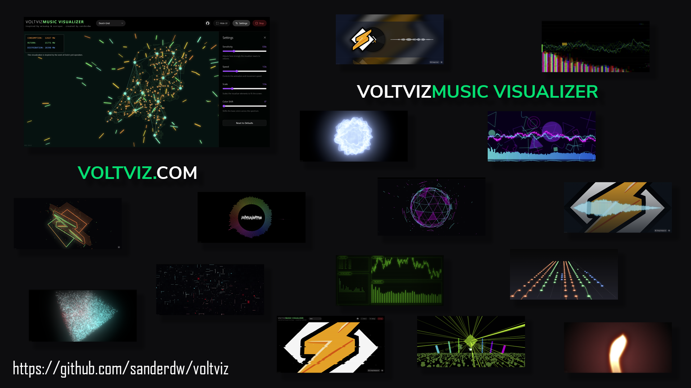

# VoltViz
> **A dynamic, real-time music visualizer** that transforms sound into stunning visual experiences. Synchronize with your system audio, microphone, or [Sendspin](https://www.sendspin-audio.com) server and watch your music come alive.

   

[](https://voltviz.com)
---

## 🎨 Features

VoltViz comes with **30+ stunning visualization styles** to choose from:

- **Particle Effects**: WebGL Particles, Data Cloud, Fireworks
- **Abstract Patterns**: CyberMatrix, Neon Hex Tunnel, Neon Wave
- **3D Visualizations**: Poly Sphere, Perlin Sphere, 3D Equalizer
- **Retro Styles**: CRT Terminal, Vinyl Record, Glitch Effects
- **Festival Vibes**: Festival Stage, Mega Festival Stage, Disney Drone Show
- **Organic Effects**: Fluid Smoke, Ghost Rainbow, Psychedelic Skull
- **Data Driven**: Music Grid, WebGL Music Grid, Data Dashboard
- **And many more**: Bars, Circular, Tunnel, Wave Terrain, Blur Visualizer...

**Core Capabilities:**
- 🎤 **Real-time Audio Input**: Connect microphone, capture system audio, or stream from a [Sendspin](https://www.sendspin-audio.com) server
- 📊 **High-Performance Rendering**: GPU-accelerated with Three.js and WebGL
- ⚙️ **Interactive Controls**: Pause, resume, and switch between visualizations
- 🎯 **Responsive Design**: Works seamlessly on desktop and tablet devices
- 🐳 **Docker Ready**: Pre-configured for containerized deployment

---

## 🚀 Quick Start

### Prerequisites
- **Node.js** (v18 or higher)
- **npm** or **yarn**

### Local Development

1. **Install dependencies:**
   ```bash
   npm install
   ```

2. **Start the development server:**
   ```bash
   npm run dev
   ```

3. **Open in your browser:**
   ```
   http://localhost:3000
   ```

### Docker Deployment

**Build and run the production container:**
```bash
docker build -t voltviz . && docker run --rm -p 8080:80 voltviz
```

**Then open:**
```
http://localhost:8080
```

---

## 📦 Available Scripts

| Command | Description |
|---------|-------------|
| `npm run dev` | Start development server on port 3000 |
| `npm run build` | Build for production |
| `npm run preview` | Preview production build locally |
| `npm run clean` | Remove build artifacts |
| `npm run lint` | Check TypeScript for errors |

---

## 🛠 Technology Stack

**Frontend:**
- **React** 19.2 - UI framework
- **TypeScript** 6.0 - Type-safe development
- **Vite** 8.0 - Next-gen build tool
- **Three.js** 0.183 - 3D graphics
- **D3.js** 3.1 - Data visualization
- **Tailwind CSS** 4.2 - Utility-first styling
- **Lucide React** - Icon library

**Infrastructure:**
- **Docker** - Containerization
- **Nginx** - Web server & reverse proxy
- **GitHub Actions** - CI/CD automation

---

## 📂 Project Structure

```
src/
├── components/
│   └── visualizers/        # 30+ visualization components
├── data/                   # Static data (geographic, etc.)
├── images/                 # Asset images
├── App.tsx                 # Main app component
├── main.tsx                # Entry point
├── types.ts                # TypeScript definitions
└── index.css               # Global styles

nginx/
└── default.conf            # Nginx configuration for production
```

---

## 🎯 How It Works

1. **Audio Capture**: VoltViz captures audio from your microphone, system audio, or a [Sendspin](https://www.sendspin-audio.com) server
2. **Frequency Analysis**: Uses Web Audio API to analyze frequency data in real-time
3. **Visualization**: Renders synchronized visualizations using Three.js and Canvas
4. **Interactivity**: Switch between different visual styles on-the-fly

---

## 📡 Sendspin Support

VoltViz supports [Sendspin](https://www.sendspin-audio.com), a synchronized multi-room audio streaming protocol. Click the **Sendspin** button and enter your server URL to visualize audio from any Sendspin-compatible server.

### Running a Local Sendspin Server

You can quickly start a local Sendspin server using [uvx](https://docs.astral.sh/uv/):

```bash
uvx sendspin serve https://uto-mix.sanwil.net/DJ%20de%20Wildt%20-%20UTO%20Mix%201%20uto-oosterhout.nl.mp3
```

Then in VoltViz, click **Sendspin** and enter `http://localhost:8095` to connect.

---

## 🔧 Development

### Lint TypeScript
```bash
npm run lint
```

### Build for Production
```bash
npm run build
npm run preview  # Test production build locally
```

### Environment Setup

The app requires **microphone or display-capture permissions** to function properly. When you first load VoltViz, you'll be prompted to grant these permissions.

---

## 🚀 CI/CD Pipeline

VoltViz includes a GitHub Actions workflow that automatically builds and publishes Docker images to GitHub Container Registry (GHCR).

### Automatic Deployment

The workflow triggers on:
- **Push to main/master branches**: Builds and publishes with `latest` tag
- **Git tags** (e.g., `v1.0.0`): Publishes with semantic version tags
- **Pull requests**: Builds images for testing (doesn't push)
- **Manual trigger**: Via GitHub Actions UI

### Image Tags

Images are automatically tagged as:
- `ghcr.io/sanderdw/voltviz:latest` (on main branch)
- `ghcr.io/sanderdw/voltviz:v1.0.0` (on version tags)
- `ghcr.io/sanderdw/voltviz:main` (branch name)
- `ghcr.io/sanderdw/voltviz:sha-abc123def` (commit SHA)

### Pull Docker Image

```bash
docker pull ghcr.io/sanderdw/voltviz:latest
docker run -p 8080:80 ghcr.io/sanderdw/voltviz:latest
```

### Manual Build & Push

```bash
# Build locally
docker build -t ghcr.io/sanderdw/voltviz:latest .

# Push to registry (requires authentication)
docker push ghcr.io/sanderdw/voltviz:latest
```

For authentication, follow the [GitHub Container Registry documentation](https://docs.github.com/en/packages/working-with-a-github-packages-registry/working-with-the-container-registry).

---

## 📝 License

MIT © 2026 VoltViz

---

## 🤝 Contributing

Contributions are welcome! Whether you want to add new visualizations, improve performance, or fix bugs, feel free to open a pull request.

---

## 💡 Tips

- **Best Experience**: Use with headphones and a full-screen window
- **GPU Performance**: Works best in modern browsers (Chrome, Firefox, Edge)
- **Audio Sources**: Try different audio sources (music, podcasts, ambient sounds) for unique visual effects

---

**Enjoy the show!** ✨
