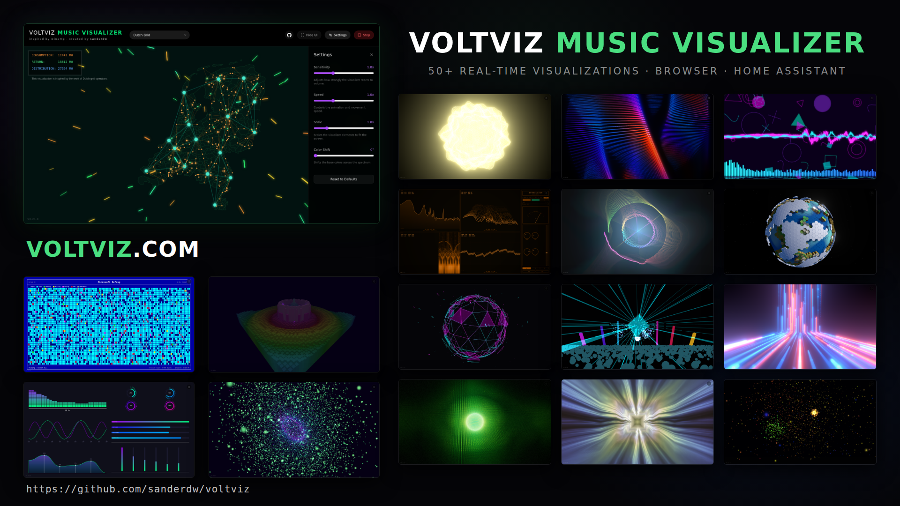
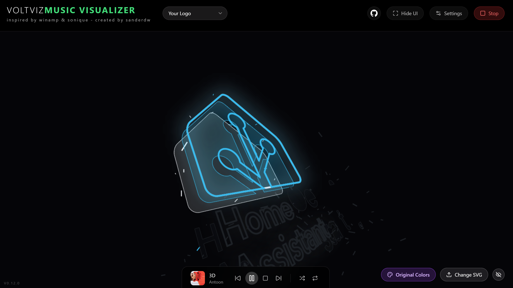

# VoltViz
> **A dynamic, real-time music visualizer** that transforms sound into stunning visual experiences. Synchronize with your system audio, microphone and [Music Assistant](https://music-assistant.io) support (through [Sendspin](https://www.sendspin-audio.com)) and watch your music come alive.

## Home Assistant App now available
[](https://my.home-assistant.io/redirect/supervisor_add_addon_repository/?repository_url=https%3A%2F%2Fgithub.com%2Fsanderdw%2Fhassio-addons)

[https://github.com/sanderdw/hassio-addons](https://github.com/sanderdw/hassio-addons)

## 🎨 Features

   

[](https://voltviz.com)
---

VoltViz comes with **50+ stunning visualization styles** to choose from:

- **Particle Effects**: Cosmic Particles, Fireworks Show, Trails Stream
- **Abstract Patterns**: Cyber Matrix, Cyber Grid Canvas, Cyber City, Neon Wave, Aurora Waves, Shambhala
- **3D Visualizations**: Poly Sphere, Glow Sphere, 3D Equalizer, Hex Globe, Fractal Orb, Anunaki Sphere, Aurum Leaf
- **Retro Styles**: CRT Terminal, Halftone Pulse, Vinyl, VU Meter, Sheet Music, Glitch Background, Glitch Databend, MS Defrag
- **Festival Vibes**: Defqon Mainstage, Disney Drone Show
- **Organic Effects**: Fluid Smoke, Psychedelic Skull, Flame
- **Data Driven**: Dutch Grid, Dutch Grid (WebGL), Data Dashboard, Audio Debug, Raw Audio
- **MilkDrop-inspired**: MilkDrop, MilkDrop Warp
- **And many more**: Bars, Circular, Tunnel, Background Image, Blur Image, Your Logo, Icons, and Sendspin variants...

**UI Skins:** Switch the entire interface between **Modern**, **Win95**, **Winamp**, and **CRT** themes via the `?skin=` URL parameter.

**Core Capabilities:**
- 🎤 **Real-time Audio Input**: Connect microphone, capture system audio, or stream from a [Sendspin](https://www.sendspin-audio.com) server
- 📊 **High-Performance Rendering**: GPU-accelerated with Three.js and WebGL
- ⚙️ **Interactive Controls**: Pause, resume, and switch between visualizations
- 🎯 **Responsive Design**: Works seamlessly on desktop and tablet devices
- 🐳 **Docker Ready**: Pre-configured for containerized deployment

---

## 🚀 Quick Start

### Prerequisites
- **Node.js** 22.18 or newer (CI and Docker use Node 26)
- **npm**

### Local Development

1. **Install dependencies:**
   ```bash
   npm install
   ```

2. **Start the development server:**
   ```bash
   npm run dev
   ```

3. **Open in your browser:**
   ```
   http://localhost:3000
   ```

### Docker Deployment

**Build and run the production container:**
```bash
docker build -t voltviz . && docker run --rm -p 8080:80 voltviz
```

**Then open:**
```
http://localhost:8080
```

---

## 📦 Available Scripts

| Command | Description |
|---------|-------------|
| `npm run dev` | Start development server on port 3000 |
| `npm run build` | Build for production |
| `npm run preview` | Preview production build locally |
| `npm run clean` | Remove build artifacts |
| `npm run lint` | Check TypeScript for errors |
| `npm run test` | Run the Playwright e2e tests |
| `npm run test:install` | Download the Playwright Chromium browser |
| `npm run test:unit` | Run the audio engine unit tests (vitest) |
| `npm run new:viz -- <id> "<Name>"` | Scaffold a new visualizer (see `.github/skills/adding-visualizer/SKILL.md`) |
| `npm run eval:prepare` / `eval:mix` / `eval:live` | Beat-tracking evaluation on the test mix (`-- --manifest scripts/eval/genres.json`: on genre excerpts from your own music library) |
| `npm run report` | Rebuild the evidence report for the current version, `docs/reports/audio-engine-report-<version>.html` (earlier reports stay next to it) |

---

## 🛠 Technology Stack

**Frontend:**
- **React** - UI framework
- **TypeScript** - Type-safe development
- **Vite** - Next-gen build tool
- **Three.js** - 3D graphics
- **d3-geo** - Map projections (Dutch Grid)
- **ONNX Runtime Web** - Runs the AI beat-tracking model in the browser
- **Tailwind CSS** - Utility-first styling
- **Lucide React** - Icon library
- **[@sendspin/sendspin-js](https://www.sendspin-audio.com)** - Synchronized audio streaming client

**Infrastructure:**
- **Docker** - Containerization
- **Nginx** - Web server & reverse proxy
- **GitHub Actions** - CI/CD automation

---

## 📂 Project Structure

```
src/
├── audio/                  # Audio engine (no React, no visuals)
│   ├── core/               # Pure DSP: onsets, tempo, beat tracking, heard beats, levels, neural arbiter
│   ├── neural/             # Log-mel front end + ONNX beat model (runs in a Web Worker)
│   ├── host/               # AudioWorklet host (ScriptProcessor fallback), shared analyser pool
│   ├── sources/            # Microphone, system audio, Sendspin, dev-only test audio
│   ├── AudioEngine.ts      # One AudioContext per session -> one AudioFrame per animation frame
│   └── types.ts            # AudioFrame: beats, onsets, bands, spectrum, waveform, stereo
├── visualizers/
│   ├── impl/               # 52 visualizers as framework-free renderer modules
│   ├── runtime/            # VisualizerHost (single rAF loop, resize, errors), contract, QA probe
│   ├── lib/                # Canvas 2D / three.js / audio helpers
│   └── registry.ts         # Single source of truth: ids, names, picker order
├── app/                    # React shell: header, settings, Sendspin bar/dialog, stage, URL state
├── components/             # Visualizer picker
├── data/                   # Static data (geographic, etc.)
└── images/                 # Asset images and picker previews

public/models/              # AI beat-tracking model (beat_this small0, MIT) – see NOTICE.md
scripts/eval/               # Beat-tracking evaluation on the test mix (offline, live, before/after)
scripts/templates/          # Templates for `npm run new:viz`
docs/reports/               # Audio engine evidence report (HTML) and its data
docs/presentation/          # Conference talk about the rewrite (HTML slides)
docs/explainer/             # Animated explainer of the audio engine (HTML)
nginx/
└── default.conf            # Nginx configuration for production
```

---

## 🎯 How It Works

1. **Audio Capture**: VoltViz captures audio from your microphone, system audio, or a [Sendspin](https://www.sendspin-audio.com) server
2. **Audio Engine**: one engine analyzes the audio on the audio thread (AudioWorklet): spectra, levels, kick/snare/hat onsets and the tempo. Beat effects fire only on beats that are actually heard: a kick or snare on the tracked beat grid, about 20 ms after the hit, and they stop as soon as the drums stop. A beat strength scales the effects, so a build-up without a drum hit stays calm. Optional **AI Beat Tracking** (a small neural network running locally in the browser) keeps the beat grid on the beat rather than the off-beat, and finds the first beat of each bar. When a new song starts (or Sendspin reports a new track), the engine looks for the beat again. The **Music style** setting (Auto by default) adapts the tempo range to the genre and lets half-time music such as dubstep flash on the kick and snare instead of twice as fast.
3. **Visualization**: every visualizer receives the same analysis each frame and renders with Three.js or Canvas
4. **Interactivity**: Switch between different visual styles on-the-fly

An animated walk-through of the engine, including the Music style, Auto Gain and AI Beat Tracking settings, is in [How VoltViz hears the beat](docs/explainer/how-voltviz-hears-the-beat.html). How well the beat detection works is documented in the [audio engine report](docs/reports/audio-engine-report-0.30.0.html) (a DJ mix and songs from five other genres; its numbers predate the final 0.30.0 changes, heard beats and beat strength, and a full refresh will follow; the [0.23.0 report](docs/reports/audio-engine-report.html) covers the rewrite). The story of the rewrite, and what it shows about AI as an audio and software engineer, is told in a [conference talk](docs/presentation/ai-as-audio-engineer.html) (open it in a browser; press `?` for keys).

---

## 📡 Music Assistant / Sendspin Support


VoltViz has [Music Assistant](https://music-assistant.io) support through [Sendspin](https://www.sendspin-audio.com), an audio streaming protocol. Click the **Sendspin** button and enter your server URL to visualize audio from any Sendspin-compatible server.

Demo Sendspin server link: https://voltviz.com/?sendspin=https://sendspin-demo.voltviz.com

### Playback controls

Once connected, the bar at the bottom controls the player. It works with every Sendspin server:

- **Now playing**: artwork, title, artist and album. Without a track it says **Nothing playing** and where to start music.
- **Status**: *Paused*, *Stopped* or *Reconnecting (n/10)…*.
- **Progress**: elapsed and total time, or **LIVE** for a radio stream. Drag it to seek when the server supports seeking (Music Assistant 2.10).
- Previous, play/pause, stop and next, volume and mute, shuffle and repeat.
- **Hide**: the tab on top of the bar slides it down out of the way, leaving the tab with the current title; click it to bring the bar back.

In the [Home Assistant App](https://github.com/sanderdw/hassio-addons), opened from the Home Assistant sidebar, VoltViz also talks to Music Assistant's own API and adds:

- **Start**: when the queue is empty, pick one of your playlists (favorites first), something you played recently, or search the library, and it plays on VoltViz. Play on an empty queue opens the same list.
- **Queue**: the current and upcoming tracks; tap one to play it, or add music.
- **Favorite**: a heart that adds the current track to your Music Assistant favorites.

These Music Assistant controls are not shown on voltviz.com, in Docker or on the App's direct port.

### Deep-Link Visualizer & Settings via URL

You can link directly to a specific visualizer with custom settings using URL parameters:

```
http://localhost:8080/?viz=tunnel&sensitivity=1.5&speed=2.0&hueShift=180&scale=1.2
```

| Parameter | Description | Default |
|-----------|-------------|---------|
| `viz` | Visualizer name (e.g. `tunnel`, `polysphere`, `fractalorb`) | `halftonepulse` |
| `sensitivity` | Audio reactivity multiplier (0.1–3.0) | `1.0` |
| `speed` | Animation speed multiplier (0.1–3.0) | `1.0` |
| `hueShift` | Color shift in degrees (0–360) | `0` |
| `scale` | Element scale multiplier (0.5–3.0) | `1.0` |
| `skin` | UI theme: `modern`, `win95`, `winamp`, or `crt` | `modern` |
| `agc` | `1` enables Auto Gain (normalizes quiet inputs such as a microphone) | off |
| `aibeat` | `1` enables AI Beat Tracking (keeps beat effects on the beat; uses extra CPU) | off |
| `style` | Music style for the beat tracking: `electronic` (house, techno, trance), `hard` (hardstyle, hardcore), `bass` (dubstep, drum & bass, trap: half-time pulse), `hiphop`, `band` (rock, pop, live band), `chill` (acoustic, ballads) | `auto` |
| `shuffle` | `1` switches to a random visualizer at an interval | off |
| `shuffleTime` | Shuffle interval in seconds: `15`, `30`, `60`, `120`, `300` or `600` | `60` |
| `shufflePool` | Comma-separated visualizer ids to shuffle between | all |
| `transition` | How visualizers switch: `crossfade`, `quickcut` or `instant` | `crossfade` |

The URL updates automatically as you change the visualizer or adjust settings in the UI, so you can share or bookmark your current configuration at any time. Only non-default settings are included to keep URLs clean.

### Direct Connect via URL Parameter

You can link directly to VoltViz with a pre-filled Sendspin server URL by adding a `sendspin` query parameter:

```
http://localhost:8080/?sendspin=http://homeassistant.local:8927
```

This opens the connect dialog automatically with the URL pre-filled — just click **Connect** to start.

You can combine both: `/?sendspin=http://homeassistant.local:8927&viz=vinylsendspin&hueShift=90`

> **_NOTE:_** Mixed content is not supported in most browsers so it only works on local networks. So if you access Home Assistant by `http://homeassistant.local:8123` it works by using `http://homeassistant.local:8927` as Sendspin URL.

### Sendspin server requirements

VoltViz uses `@sendspin/sendspin-js` 5.x, which speaks the encrypted Sendspin protocol of
`aiosendspin` 9.x: use Music Assistant 2.10.0b14 or newer. The `sendspin` CLI test server
(`uvx sendspin serve`, 7.5 at the time of writing) still uses `aiosendspin` 6.x and cannot connect.

The easiest way is to run the [Docker version](#docker-deployment) of VoltViz on your local network so that it can reach the Home Assistant instance directly.

---

## 🔧 Development

See [CONTRIBUTING.md](CONTRIBUTING.md) for the checks to run before a pull request.

### Run the tests
```bash
npm run test:install
npm run test:unit
npm run test
```

On Linux, Playwright may also need system browser libraries:

```bash
npx playwright install-deps chromium
```

---

## 🚀 CI/CD Pipeline

VoltViz includes a GitHub Actions workflow that automatically builds and publishes Docker images to GitHub Container Registry (GHCR).

### Automatic Deployment

The workflow triggers on:
- **Push to `main`**: builds and publishes, including the `latest` tag
- **Push to a release branch** (named like `0.30.0`): builds and publishes that branch
- **Pull requests**: builds the image for testing (doesn't push)
- **Manual trigger**: via the GitHub Actions UI

### Image Tags

Images are automatically tagged as:
- `ghcr.io/sanderdw/voltviz:latest` (on `main`)
- `ghcr.io/sanderdw/voltviz:0.30.0` (the version in `package.json`)
- `ghcr.io/sanderdw/voltviz:main` (branch name)
- `ghcr.io/sanderdw/voltviz:sha-abc123d` (commit SHA)

### Pull Docker Image

```bash
docker pull ghcr.io/sanderdw/voltviz:latest
docker run -p 8080:80 ghcr.io/sanderdw/voltviz:latest
```

To push images by hand, authenticate first: see the [GitHub Container Registry documentation](https://docs.github.com/en/packages/working-with-a-github-packages-registry/working-with-the-container-registry).

---

## 📝 License

MIT © 2026 VoltViz Contributors, see [LICENSE](LICENSE). Some visualizer shaders keep their own (non-commercial) license, and bundled libraries, the beat model and map data are credited in [THIRD_PARTY_NOTICES.md](THIRD_PARTY_NOTICES.md).

---

## 🤝 Contributing

Contributions are welcome! Whether you want to add new visualizations, improve performance, or fix bugs, read [CONTRIBUTING.md](CONTRIBUTING.md) and open a pull request. Security issues: see [SECURITY.md](SECURITY.md).

---

## 🎨 Credits

Special shoutout to [@sabosugi](https://x.com/sabosugi) for the nice visuals. Moss Ball uses shaders from [imoss](https://github.com/ledhieu/imoss) by ledhieu, Flame a shader by kuvkar, and AI Beat Tracking the [Beat This!](https://github.com/CPJKU/beat_this) model by JKU Linz. Full credits: [THIRD_PARTY_NOTICES.md](THIRD_PARTY_NOTICES.md).

---

## 💡 Tips

- **Best Experience**: Use with headphones and a full-screen window
- **GPU Performance**: Works best in modern browsers (Chrome, Firefox, Edge)
- **Audio Sources**: Try different audio sources (music, podcasts, ambient sounds) for unique visual effects

---

**Enjoy the show!** ✨
